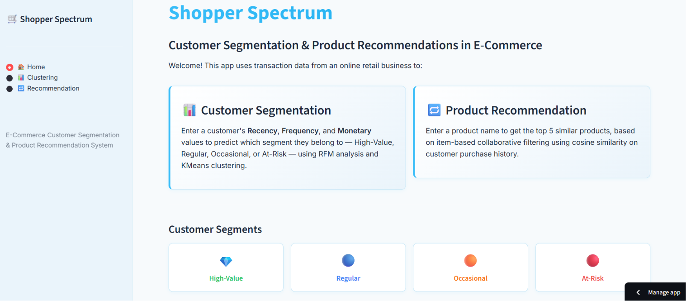

# 🛒 Shopper Spectrum: Customer Segmentation and Product Recommendations in E-Commerce

[](https://shopper-spectrum-izebcful5ygeybxjxrvdxr.streamlit.app/)

An end-to-end data science project on e-commerce transaction data that:
1. Segments customers using **RFM analysis** and **KMeans clustering**
2. Recommends similar products using **item-based collaborative filtering** (cosine similarity)
3. Deploys both as an interactive **Streamlit** web app



## 📂 Project Structure

## 🧠 Approach

### Data Preprocessing
- Removed rows with missing `CustomerID`
- Excluded cancelled invoices (`InvoiceNo` starting with 'C')
- Removed negative/zero `Quantity` and `UnitPrice`
- Removed duplicate rows
- Final dataset: **392,692 transactions | 4,338 customers | 3,665 products**

### Customer Segmentation (RFM + KMeans)
- **Recency**: Days since last purchase
- **Frequency**: Number of distinct purchases
- **Monetary**: Total amount spent
- Log-transformed + standardized, then clustered with **KMeans (k=4)**
- Chosen via Elbow Method + Silhouette Score (silhouette ≈ 0.34)
- Clusters labeled by interpreting RFM averages:

| Segment | Recency | Frequency | Monetary | % of Customers |
|---|---|---|---|---|
| 💎 High-Value | ~12 days | ~14 | ~£8,088 | 16.4% |
| 🔵 Regular | ~72 days | ~4 | ~£1,802 | 26.9% |
| 🟠 Occasional | ~18 days | ~2 | ~£557 | 19.3% |
| 🔴 At-Risk | ~182 days | ~1 | ~£341 | 37.4% |

### Product Recommendation (Item-Based Collaborative Filtering)
- Built a Customer × Product matrix (purchase quantities)
- Computed cosine similarity between products based on co-purchase patterns
- Given a product, returns the top 5 most similar products

## 🚀 Running Locally

```bash
pip install -r requirements.txt
streamlit run app.py
```

## 📱 App Features

- **Home** — Project overview and segment descriptions
- **Clustering** — Enter Recency, Frequency, Monetary → predicts customer segment
- **Recommendation** — Select a product → get 5 similar product recommendations

## 🛠 Tech Stack

Python, Pandas, NumPy, Scikit-learn, Matplotlib, Seaborn, Streamlit